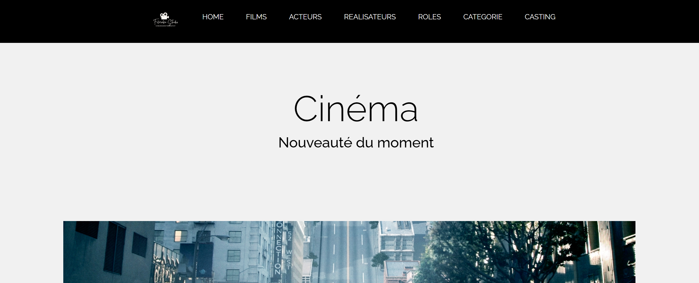

# CINEMA 

##  Description 
Ce projet est une application web qui fonctionne comme une base de données de cinéma et une plateforme collaborative pour les passionnés de films. Les utilisateurs peuvent contribuer des informations sur les films, les acteurs, les réalisateurs, les genres, et plus encore pour créer des profils détaillés.

## Technologies utilisées
HTML-CSS | PHP | MySQL | JavaScript | jQuery | AJAX

## Points important
▪ Gestion de la Base de Données : Les utilisateurs peuvent ajouter des informations sur les films, les acteurs, les réalisateurs, les genres et d'autres détails connexes.  

## Compétence acquise 
▪ Sécurité : Mise en place de mesures de sécurité, notamment lors de la manipulation de la base de données avec des instructions préparées et le filtrage/la désinfection des données.  
▪ Opérations CRUD : Réalisation des opérations de Création, Lecture, Mise à jour et Suppression au sein de l'application.  
 
